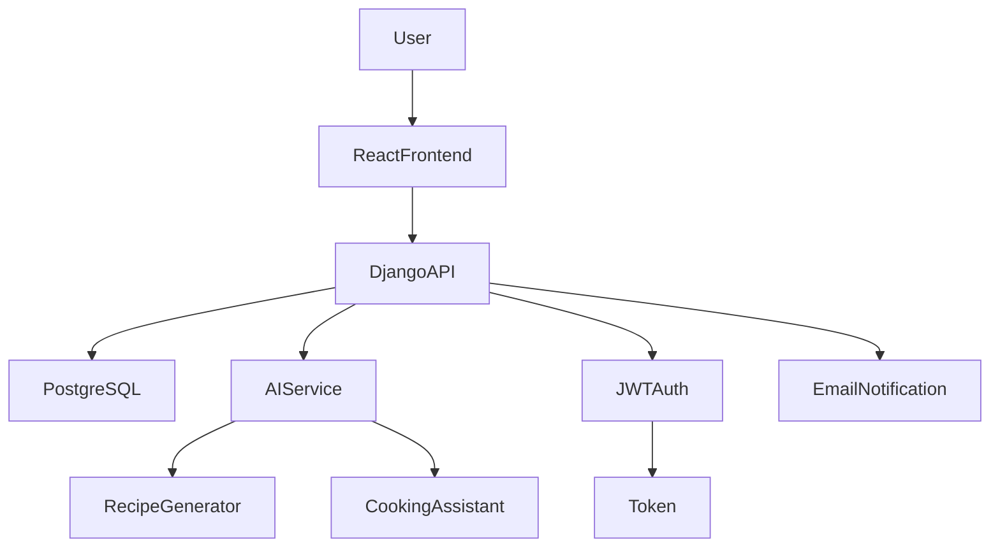
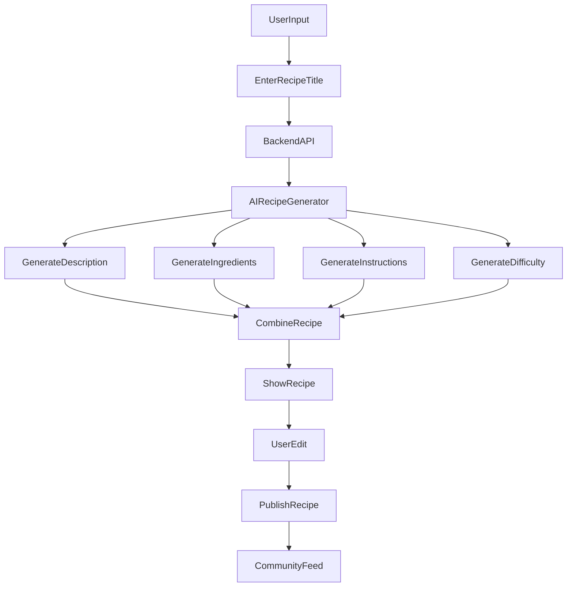

# 🍳 AI Powered Recipe Sharing Platform


An **AI powered recipe sharing platform** where users can create, discover, and interact with recipes using modern web technologies and artificial intelligence.

This platform combines **AI automation, social features, and scalable full stack architecture** to create an intelligent cooking community.

Repository
[https://github.com/raghuram-007/AI-Powered-Recipe-Sharing-Platform](https://github.com/raghuram-007/AI-Powered-Recipe-Sharing-Platform)

Author GitHub
[https://github.com/raghuram-007](https://github.com/raghuram-007)

---

# 🚀 Project Overview

The AI Powered Recipe Sharing Platform allows users to:

* Create and publish recipes
* Discover trending recipes
* Interact with other users
* Receive AI powered cooking assistance

The system integrates **AI recipe generation and an AI cooking assistant** to enhance the cooking experience.

---

# ✨ Key Features

## 🤖 AI Recipe Generator

Users only need to enter the **recipe title**.

The AI automatically generates:

* Recipe description
* Ingredients list
* Step by step instructions
* Difficulty level (easy, medium, hard)

Users can edit the generated recipe before publishing.

---

## 🧠 AI Cooking Coach

Each recipe page contains an **AI assistant** that helps users with:

* Cooking guidance
* Ingredient substitutions
* Recipe explanations
* Cooking tips

This works like a **personal cooking mentor**.

---

## 👥 Social Features

Users can interact with the community through:

* Follow creators
* Personalized recipe feed
* Share recipes with followers
* Share recipes to external social media

---

## 💬 Community Interaction

Users can engage with recipes using:

* Comments
* Ratings
* Feedback

This helps identify the best recipes on the platform.

---

## ❤️ Favorite Recipes

Users can add recipes to their **favorites list** and easily access them later.

---

## 🔍 Recipe Discovery

The platform helps users discover new recipes through:

* Related recipe suggestions
* AI powered trending recipes
* Category browsing
* Filtering system

---

## 🔔 Notification System

The system includes **email notifications** for events such as:

* New comments
* New followers
* Recipe interactions

---

# 🏗 System Architecture



---

# 🤖 AI Workflow



---

# 🧱 Tech Stack

Frontend
React
Tailwind CSS

Backend
Django REST Framework

Database
PostgreSQL

Authentication
JWT Authentication

AI Integration
AI recipe generator
AI cooking assistant

---

# 📊 Feature Summary

| Feature             | Description                                  |
| ------------------- | -------------------------------------------- |
| AI Recipe Generator | Generate complete recipe from title          |
| AI Cooking Coach    | AI assistant for cooking help                |
| Follow System       | Follow other creators                        |
| Feed System         | Personalized recipe feed                     |
| Comments            | Users can comment                            |
| Ratings             | Recipe rating system                         |
| Favorites           | Save recipes                                 |
| Sharing             | Share recipes with followers or social media |
| Related Recipes     | Suggest similar recipes                      |
| Trending Discovery  | AI powered trending recipes                  |
| Notifications       | Email alerts                                 |
| Authentication      | JWT secure login                             |

---

# 💻 Installation

Clone repository

```bash
git clone https://github.com/raghuram-007/AI-Powered-Recipe-Sharing-Platform.git
```

Go to project folder

```bash
cd AI-Powered-Recipe-Sharing-Platform
```

Backend setup

```bash
pip install -r requirements.txt
python manage.py migrate
python manage.py runserver
```

Frontend setup

```bash
npm install
npm run dev
```


---

# 🔮 Future Improvements

* Advanced recommendation system
* Voice based cooking assistant

---

# 👨‍💻 Author

Raghuram
Full Stack Developer

GitHub
[https://github.com/raghuram-007](https://github.com/raghuram-007)

---

# ⭐ Support

If you like this project, please **star the repository on GitHub**.

